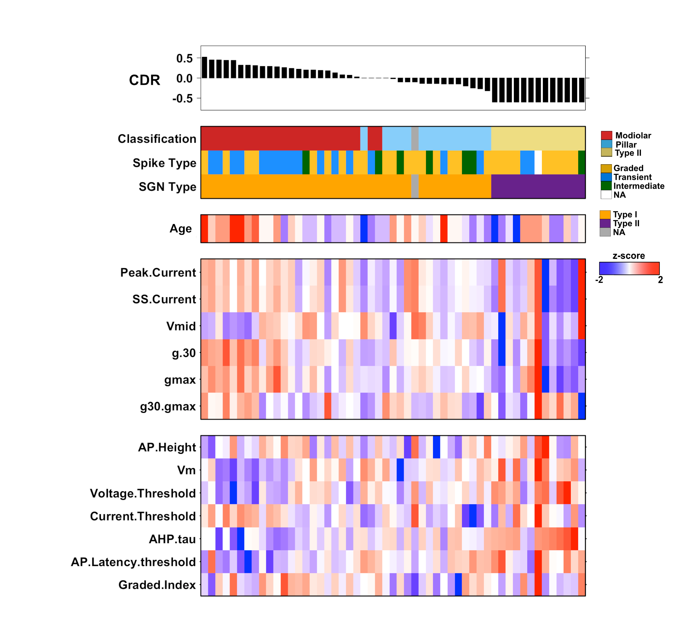

# Gradients in the biophysical properties of neonatal auditory neurons align with synaptic contact position and the intensity coding map of inner hair cells

## Abstract
Sound intensity is encoded by auditory neuron subgroups that differ in thresholds and spontaneous rates. Whether variations in neuronal biophysics contributes to this functional diversity is unknown. Because intensity thresholds correlate with synaptic position on sensory hair cells, we combined patch clamping with fiber labeling in semi-intact cochlear preparations in neonatal rats from both sexes. The biophysical properties of auditory neurons vary in a striking spatial gradient with synaptic position. Neurons with high thresholds to injected currents contact hair cells at synaptic positions where neurons with high thresholds to sound-intensity are found in vivo. Alignment between in vitro and in vivo thresholds suggests that biophysical variability contributes to intensity coding. Biophysical gradients were evident at all ages examined, indicating that cell diversity emerges in early post-natal development and persists even after continued maturation. This stability enabled a remarkably successful model for predicting synaptic position based solely on biophysical properties.

### Result Summary

## License

Author: Alexander Markowitz(alexmarkowitz@icloud.com), Radha Kalluri(radha@usc.edu)

[This project] is licensed under the GNU General Public License version 3. See the file LICENSE.md for the terms of the GNU GPL license.
